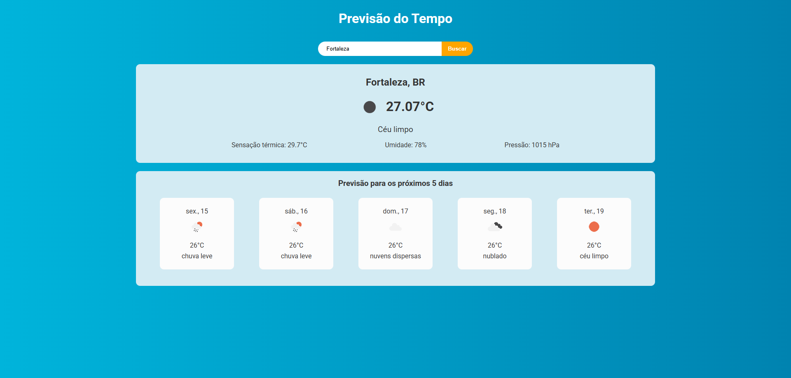

<div align="center">
	<h1>App Previsão do Tempo ☀️🌧️</h1>
	</p>
		<!-- 
		 -->
		
		
		
		
		
	</p>
</div>

# App Previsão do Tempo ☀️🌧️

Este é um projeto simples em React, feito por mim para colocar em prática conceitos e funcionalidades básicas que foram estudadas até o momento. Ele consulta a previsão do tempo atual e dos próximos 5 dias de qualquer cidade, utilizando a API OpenWeatherMap.

## Demonstração



## Funcionalidades
- Busca por cidade
- Exibe informações do clima atual (temperatura, sensação térmica, umidade, pressão, descrição e ícone)
- Exibe previsão para os próximos 5 dias
- Mensagens de erro amigáveis
- Interface responsiva e acessível

## Tecnologias Utilizadas
- [React](https://react.dev/)
- [Vite](https://vitejs.dev/)
- [Axios](https://axios-http.com/)
- [OpenWeatherMap API](https://openweathermap.org/api)

## Como rodar o projeto

1. **Clone o repositório:**
	```bash
	https://github.com/Kauanrodrigues01/app-previsao-do-tempo-react.git
	cd app-previsao-do-tempo-react
	```

2. **Instale as dependências:**
	```bash
	npm install
	```

3. **Configure a chave da API:**
	- Crie um arquivo `.env` na raiz do projeto com o conteúdo:
	  ```env
	  VITE_API_KEY=SuaChaveDaAPI
	  ```
	- Você pode obter uma chave gratuita em [OpenWeatherMap](https://openweathermap.org/api).

4. **Inicie o projeto:**
	```bash
	npm run dev
	```
	O app estará disponível em `http://localhost:5173`.

## Estrutura de Pastas
```
├── public/
├── src/
│   ├── assets/
│   ├── components/
│   │   ├── ForecastInformations/
│   │   └── WeatherInformations/
│   ├── App.jsx
│   └── main.jsx
├── .env
├── package.json
└── README.md
```
---
